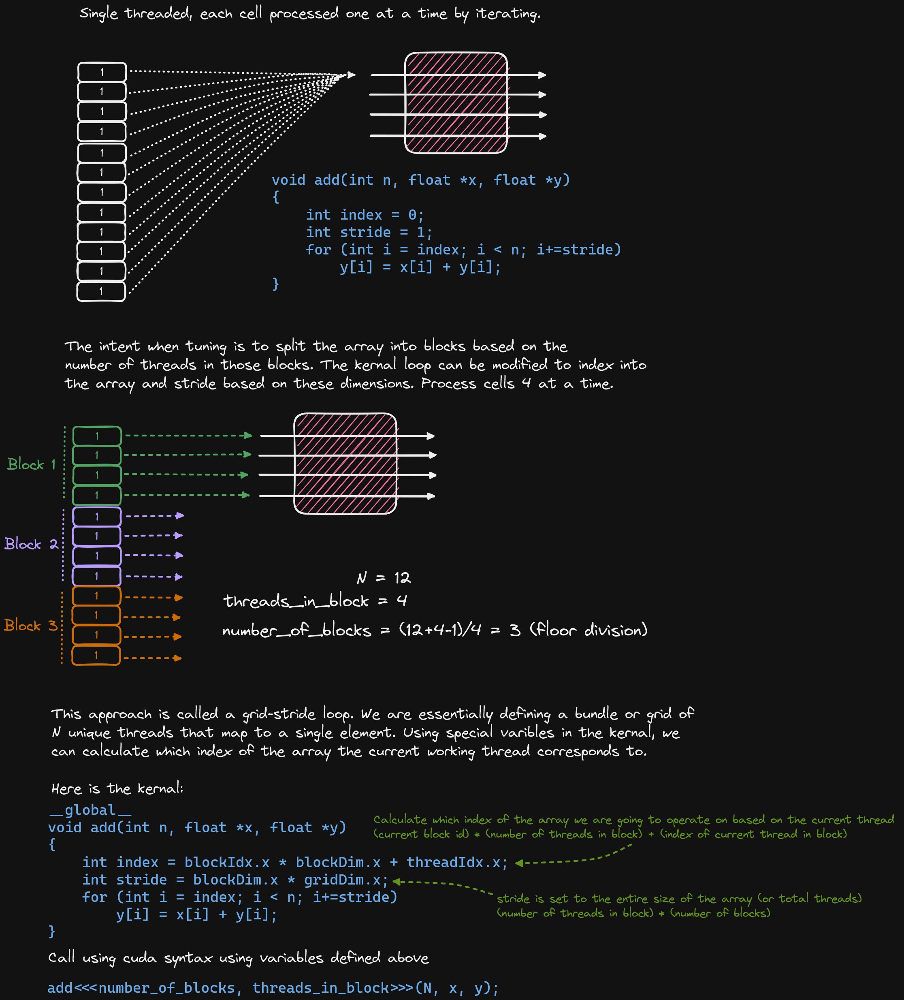

# cuda-intro
This repo contains a simple program that adds two vectors in parallel using cuda. The original source material can be found here https://developer.nvidia.com/blog/even-easier-introduction-cuda/. 
## Tools and requirements
To compile the code in this repo, you will need a c/c++ compiler like `gcc` or `g++` along with cuda and nvidia-cuda-toolkit. Information about setting up and configuring CUDA to work on your machine can be found here:

- [Installation Guide for Linux](https://docs.nvidia.com/cuda/cuda-installation-guide-linux/index.html)
- [CUDA Quick Start Guide](https://docs.nvidia.com/cuda/cuda-quick-start-guide/index.html)

You will need an Nvidia gpu to run the CUDA code, however you dont need one to compile and install the toolkit. 

On Ubuntu 20.04 (x86) install cuda & the toolkit by running the following commands

```
wget https://developer.download.nvidia.com/compute/cuda/repos/ubuntu2004/x86_64/cuda-ubuntu2004.pin
sudo mv cuda-ubuntu2004.pin /etc/apt/preferences.d/cuda-repository-pin-600
wget https://developer.download.nvidia.com/compute/cuda/12.0.0/local_installers/cuda-repo-ubuntu2004-12-0-local_12.0.0-525.60.13-1_amd64.deb
sudo dpkg -i cuda-repo-ubuntu2004-12-0-local_12.0.0-525.60.13-1_amd64.deb
sudo cp /var/cuda-repo-ubuntu2004-12-0-local/cuda-*-keyring.gpg /usr/share/keyrings/
sudo apt-get update
sudo apt-get -y install cuda
```

```
sudo apt install nvidia-cuda-toolkit
```

Instructions to download versions for other systems, like WSL, can be found here: https://developer.nvidia.com/cuda-downloads

## Code Notes



More information about grid-stride loops can be found here: https://developer.nvidia.com/blog/cuda-pro-tip-write-flexible-kernels-grid-stride-loops/

## Compiling, Running, & Benchmarking
Now that you have the cuda toolkit installed, you can compile, run, and benchmark the code

### Single threaded c++
Compile:
```
 g++ add.cpp -o add
```
Run the code:
```
./add
```
Time its execution:
```
time ./add
```

### CUDA 
Compile:
```
nvcc add.cu -o add_cuda
```
Run the code:
```
./add_cuda
```
Time its execution:
```
time ./add_cuda
```
Benchmark and profile using Nvidia's profiling tool:
```
nvprof ./add_cuda
```
